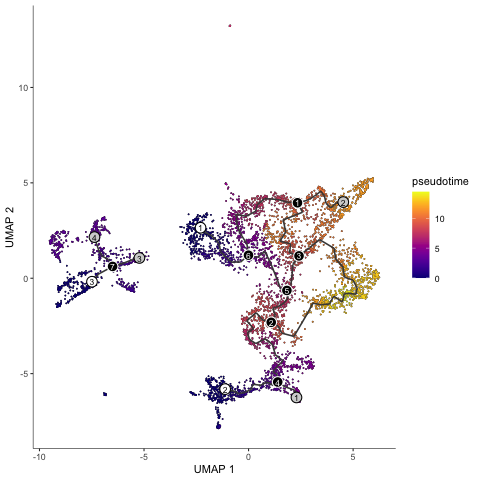

# Overview

The interest of this report is the **<span style="color:blue">characterizing of neural cells during the developing human cortex</span>** using the provided Seurat object. \

\
<center></center> 

\

To get insight from  **<span style="color:red"> your data  </span>**, I can propose the following analyses:

* Cell types Identification (Subtyping).
* Differential Gene Expression Analysis.
* Trajectory Analysis.

\

```{r librabires, echo=FALSE, warning=FALSE, include=FALSE}
## loading libraries
library("Seurat")
library("ggplot2")
library("tidyverse")
library("monocle3")
library("biomaRt")
library("org.Hs.eg.db")


```


```{r data , echo=FALSE, warning=FALSE, include=FALSE}
seur_obj <- readRDS("seurat_subset_test.rds")
unique(seur_obj$sample_batch)

gene_annotation <- data.frame(GeneIds= rownames(seur_obj))
rownames(gene_annotation) <- gene_annotation$GeneIds
# getting gene names from enseml gene ids 
gene_annotation$GeneNames<- mapIds(org.Hs.eg.db, 
                                  keys = gene_annotation$GeneIds,
                                  keytype = "ENSEMBL",
                                  column = "SYMBOL")

mt_gn <- gene_annotation$GeneIds[grep("^MT", gene_annotation$GeneNames)]
```


In this analysis, we will perform analysis of single cell data from human cortex cells, we have  `r  ncol(seur_obj@assays$RNA$data)` cells from `r length(unique(seur_obj$sample_batch)) ` batch \

I will perfrom seurat worflow analysis after checking if there is any batch effect to correct 

# Data Analysis 

## Quality control 
As we can see in the **Figure 1** (violin plots), the data provided has a good quality (**0 %** of mitochondrial genes, the minimal number of genes detected in each cell is **501** and the minimal number of molecules detected within a cell is **642**) \
**NB: This data seems to be already filtered so no cut needed.**


```{r qc , echo=FALSE, warning=FALSE, include= TRUE}
seur_obj@active.ident <- as.factor(seur_obj$orig.ident)
seur_obj$mitopercent <- PercentageFeatureSet(seur_obj, features = mt_gn)

p1 <- VlnPlot(seur_obj, features = c("nFeature_RNA", "nCount_RNA", "mitopercent"), ncol = 3) +ggtitle("Figure 1 quality control")
p1


```


## Cell types Identification (Subtyping):

After clustering using  Seurat to identify (using public and available genes marker genes) all cells population present in your dataset. This will allow us to explore the heterogeneity of neural subtypes during this developmental window (pcw16, pcw20, pcw21 and pcw24).  \
The *potential limitation* here is that the provided dataset may not capture the full diversity of cell subtypes, some cells are less abundant. Also, the cluster assignments could be struggling because some gene markers are not robust .

But : when I checked the metadata slot in the provided Seurat object, I saw that the pre-analysis (including clustering and cell populations definition) are already done \ as the **Figure 2** show we can note `r length(unique(seur_obj$Manual_type))` cell types identified (with one cluster of aknown cells). \
No batch effect was detected in the **Figure 3** population providing from several batch are clustering together, that why I will skip the correction step. 


```{r clustering , echo=FALSE, warning=FALSE, include= TRUE}

seur_obj@active.ident <- as.factor(seur_obj$Manual_type)

p2 <- DimPlot(seur_obj, reduction = "umap", label = TRUE, label.size = 3) + NoLegend() + ggtitle("Figure 2: UMAP showing cell populations")
p3 <- DimPlot(seur_obj, reduction = "umap", group.by = "sample_batch") + ggtitle("Figure 3: UMAP showing sample batchs")
p4 <- DimPlot(seur_obj, reduction = "umap", group.by   = "sample_time") + ggtitle("Figure 4: UMAP showing sample times (by week) sequencing")

p2
p3
p4
  


```


## Differential Gene Expression Analysis:

After quality control and cell types identification, we can perform a differential gene expression analysis (DEG) to identify genes that are specifically upregulated in each subtype. \
This will provide insights into the molecular characteristics of these subtypes and potentially reveal functional differences.  \
Differential gene expression analysis is performed to identify genes specifically upregulated in each subtype. \
Since the dataset is a subset, which might limit the depth of analysis, I will normalize and scale data before the maker identification step.\
The heatmap shows the expression of top 30 markers for each cell population found. We can draw several pieces of information, like for example : the  Outer radial glia 1 and 2 seems express the same blocs of genes with a one bloque (1 in the top) overexpressed in the Outer radial glia 2 population (same in Interneurons 1 and 2) ...


**NB:** I left the "unknown" population ,by purpose, to try to extract information (manually from literature) after extracting the list of marker genes. 

```{r DEG , echo=FALSE, warning=FALSE, include=TRUE}
seur_obj <- NormalizeData(seur_obj)
seur_obj <- FindVariableFeatures(seur_obj)
seur_obj <- ScaleData(seur_obj)

 
#marker_list <- FindAllMarkers(seur_obj, only.pos = TRUE)  #this will make time, I will comment it & fell free to rerun it if nedeed
#saveRDS(marker_list, "marker_list_human_cortex.RDS")

marker_list <- read_rds("marker_list_human_cortex.RDS")

marker_list %>%
  group_by(cluster) %>%
  dplyr::filter(avg_log2FC > 1)  %>%
  slice_head(n = 30) %>%
  ungroup() -> Top30Marker
  
DoHeatmap(seur_obj, features = Top30Marker$gene, slot = "scale.data", size = 3) + NoLegend() +ggtitle("figure 5: molecular signature of cells")

```


\
List of top 30 gene markers of "Unknown" cells : `r gene_annotation$GeneNames[gene_annotation$GeneIds %in% Top30Marker$gene[Top30Marker$cluster =="Unknown"]]`` \
for example : The specific function of this "FOXD2" has not yet been determined, NGF: nerve growth factor, troponin T2, cardiac type ...

## Trajectory Analysis:
As cells move between states, they undergo a process of transcriptional re-configuration, with some genes being silenced and others newly activated producing a dynamic repetoire of proteins and metabolites that carry out their work. 
To explore the developmental trajectories of identified cell subtypes in the human cortex, I will perform a trajectory analysis. This could reveal the differentiation paths and how these subtypes emerge during this developmental window (from pcw16 to pcw24).  
the problem here is that the trajectory analysis assumes a linear progression, which might not always reflect the real physiological cellular differentiation (complex process). \

To do that, I will use $monocle3$ which is an algorithm to learn the sequence of gene expression changes each cell must go through as part of a dynamic biological process. Once it has learned the overall "trajectory" of gene expression changes, Monocle can place each cell at its proper position in the trajectory.
The workflow used from [Link monocle's guide ](https://cole-trapnell-lab.github.io/monocle3/docs/trajectories/) 

\


Figure 6: Umap of cells colored by the pseudotime



\
\
As the Figure 6 show, the cells are plotted over a pseudotime going from zeo (blue) to 15 (yellow). Its is supposed that the cells in dark blue are the first cell to appear during differentiation (if we see the Figure 7/8 its : Outer radial glia and Microglia from pcw16 and pcw20) than in intermediate stage in red is Migrating glutamatergic neurons from pcw20 and pcw21 and the final stage will be in red with Interneurons from pcw24.    

```{r TA , echo=FALSE, warning=FALSE, include=TRUE}
# MONOCLE3 WORKFLOW ---------------------
# monocle3 requires cell_data_set object

expression_matrix <- seur_obj@assays$RNA$counts
cell_metadata <-  seur_obj@meta.data
gene_annotation <- gene_annotation

cds <- new_cell_data_set(expression_matrix,
                         cell_metadata = cell_metadata,
                         gene_metadata = gene_annotation)


cds <- preprocess_cds(cds, num_dim = 50)

cds <- align_cds(cds, alignment_group = "Manual_type")

cds <- reduce_dimension(cds)

#plot_cells(cds, label_groups_by_cluster=FALSE,  color_cells_by = "Manual_type")

rowData(cds)$gene_name <- rownames(cds)
rowData(cds)$gene_short_name <- rowData(cds)$gene_name

cds <- cluster_cells(cds)
#plot_cells(cds, color_cells_by = "Manual_type")


## Learn the trajectory graph
cds <- learn_graph(cds)
plot_cells(cds,
           color_cells_by = "Manual_type",
           label_groups_by_cluster=TRUE,
           label_leaves=FALSE,
           label_branch_points=FALSE) +ggtitle("Figure 7: umap of cells by populations")

# Order the cells in pseudotime

#cds <- order_cells(cds, reduction_method = 'UMAP')

#save the png because the ordering of the cells need to be in interactive window (feel free to test it)

#png("pseudotime.png")
#plot_cells(cds,
     #      color_cells_by = "pseudotime",
    #       label_cell_groups=TRUE,
   #        label_leaves=TRUE,
  #         label_branch_points=TRUE,
 #          graph_label_size=3) 
#dev.off()

plot_cells(cds,
           color_cells_by = "sample_time",
           label_cell_groups=FALSE,
           label_leaves=TRUE,
           label_branch_points=TRUE,
           graph_label_size=3) +ggtitle("Figure 8: umap of cells by sample time")


```


# Conclusion and perspectives
\
After all these analyses, we had a global idea about the populations and their dispersion through time, the genes on and off during each stage.
\
But, we could also perform some supplemental analysis like GO and pathway enrichment analysis on the differentially expressed genes to gain insights into the biological processes and pathways that are enriched in each cell subtype and each stage. 
\
The integration of other data type eg. single-cell ChIP-seq to explore the chromatin dynamics during cell development and to get a broader perspective. \
The integration of the spatial transcriptomic data  can  produce a high-resolution maps of cellular sub-populations in the human cortex.
\
\
\
\


---------------------------------------------------------
* pcw : post conception week 